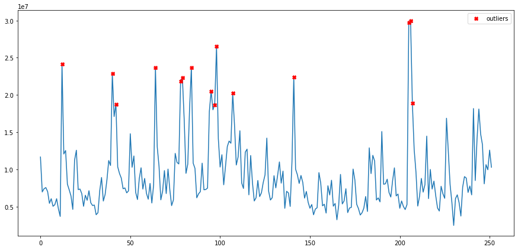
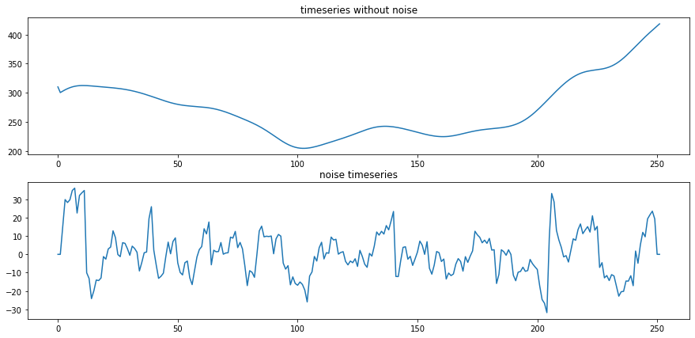

## PandaPy

#### Why PandaPy? 

1. Maintain the full functionality and speed of structured NumPy (eg., ```array[col1] + array[col2], or np.log(array[col1]```)
2. Provides wrapper functions over NumPy to give you the usability of Pandas (eg., ```pp.group(array, [col1, col2, col2], ['mean', 'std'], ['Adj_Close','Close'])```
3. If you need Pandas for speciality functions, you can easily ```df = pp.pandas(array)``` and back ```array = pp.structured(df)```
4. For simple calculations (i.e, plus, mult, log) PandaPy is 25x - 80x faster than Pandas.
5. For table functions (i.e., group, pivot, drop, concat, fillna) PandaPy is 5x - 100x times faster than Pandas.
6. For most use cases, PandaPy is faster than Dask, Ray and Pandas.
7. The best package for performance for table functions is [datatable](https://github.com/h2oai/datatable), it is 2x - 10x faster than even PandaPy. 
8. The problem is that datatable is slower with simple calculations (plus, mult, returns), it is less intuitive, does not have a large range of functions, and have very few complementary libraries, e.g. matplotlib. 

PandaPy software, similar to the original Pandas project, is developed to improve the usability of python for finance. Structured datatypes are designed to be able to mimic ‘structs’ in the C language, and share a similar memory layout. PandaPy currently houses more than 30 functions. Structured NumPy are meant for interfacing with C code and for low-level manipulation of structured buffers, for example for interpreting binary blobs. For these purposes they support specialized features such as subarrays, nested datatypes, and unions, and allow control over the memory layout of the structure. 

**Note this project is only a week old, much room for improvement, all feedback appreciated (issues tab)**

### Description

------------------------

A Structured NumPy Array is an array of structures. NumPy arrays can only contain one data type, but structured arrays in a sense create an array of homogeneous structures. This is done without moving out of NumPy such as is required with Xarray. For structured arrays the data type only has to be the same per column like an SQL data base. Each column can be another multidimensional object and does not have to conform to the basic NumPy datatypes.

PandaPy comes with similar functionality like Pandas, such as groupby, pivot, and others. The biggest benefit of this approach is that NumPy dtype(data type) directly maps onto a C structure definition, so the buffer containing the array content can be accessed directly within an appropriately written C program. If you find yourself writing a Python interface to a legacy C or Fortran library that manipulates structured data, you'll probably find structured arrays quite useful. 

### Additional

1. Play around with [speed tests here](https://colab.research.google.com/drive/1JqvplTUUciIw2KGkuoCNv196prl3eoiL). 
2. Test and explore the package with this [Google Colab Notebook](https://colab.research.google.com/drive/1j45o36_FFIof9uzp1DoyzxETD4lfpci5).
3. Get in touch on [LinkedIn](https://www.linkedin.com/company/firmai) or [Twitter](https://twitter.com/dereknow?lang=en).
4. Use ```table(array)``` to get a pandas looking table printout

### Functions

#### SPEED SPEED SPEED !!! -> Speed Over Pandas Follow the X i.e. (5X), (50X)
----------------------------------

#### Array Structure

    Read In Arrays (read)
    To Pandas (unstructured) 
    Pandas to Structured (structured) 
    To Unstructured (to_unstruct) 
    To Structured (to_struct) 
    Print Table (table) 

#### Explorative Functions

    Descriptive Statistics (describe) (5x)
    Correlation Array (corr) (2x)

#### Finance Functions

    Returns (returns) (50x)  
    Portfolio Value (portfolio_value) (50x)
    Cummulative Value (cummulative_return) (50x)
    Column Lags (lags) (7x)

#### Array Functions

    Drop Null Rows (dropnarow) (30x)
    Drop Column/s (drop) (100x)
    Add Column/s (add) (3x)
    Concatenate (concat) (rows 25x columns 70x)
    Merge (merge) (2x)
    Group by (group) (10x)
    Pivot (pivot) (20x)
    Fill Nulls (fillna) (20x)
    Shift Column (shift) (50x)
    Rename (rename) (500x)

#### Other Speed Tests

    Update (array[col] = values) (60x)
    Addition (array[col] + array[col]) (80x)
    Multiplication (array[col] * array[col]) (80x)
    Log (np.log(array[col]) (25x)
    
    
_note speed tests done on financial dataset only_

### Documentation by Example

------------------------

**Install**

```
!pip3 install pandapy
```

**Load**
```python
import pandapy as pp
import numpy as np
```

**Read In Arrays**


```python
# First Example
multiple_stocks = pp.read('https://github.com/firmai/random-assets-two/blob/master/numpy/multiple_stocks.csv?raw=true')
closing = multiple_stocks[['Ticker','Date','Adj_Close']]
piv = pp.pivot(closing,"Date","Ticker","Adj_Close"); piv
closing = pp.to_struct(piv, name_list = [x for x in np.unique(multiple_stocks["Ticker"])])

# Second Example
tsla = pp.read('https://github.com/firmai/random-assets-two/raw/master/numpy/tsla.csv')
crm = pp.read('https://github.com/firmai/random-assets-two/raw/master/numpy/crm.csv')
tsla_sub = tsla[["Date","Adj_Close","Volume"]]
crm_sub = crm[["Date","Adj_Close","Volume"]]
crm_adj = crm[['Date','Adj_Close']]
```


```
closing
```


    array([(37.24206924, 100.45429993, 44.57522202, 20.72605705, 130.59109497, 35.80251312,  41.9791832 ,  81.51140594, 66.33999634),
           (35.08446503,  97.62433624, 43.83200836, 20.34561157, 128.53627014, 35.80251312,  41.59314346,  80.89860535, 66.15000153),
           (35.34244537,  97.63354492, 42.79874039, 19.90727234, 125.76422119, 36.07437897,  40.98268127,  80.28580475, 64.58000183),
           ...,
           (21.57999992, 289.79998779, 59.08000183, 11.18000031, 135.27000427, 55.34999847, 158.96000671, 137.53999329, 88.37000275),
           (21.34000015, 291.51998901, 58.65999985, 11.07999992, 132.80999756, 55.27000046, 157.58999634, 136.80999756, 87.95999908),
           (21.51000023, 293.6499939 , 58.47999954, 11.15999985, 134.03999329, 55.34999847, 157.69999695, 136.66999817, 88.08999634)],
          dtype=[('AA', '<f8'), ('AAPL', '<f8'), ('DAL', '<f8'), ('GE', '<f8'), ('IBM', '<f8'), ('KO', '<f8'), ('MSFT', '<f8'), ('PEP', '<f8'), ('UAL', '<f8')])


**Rename**
```python
pp.rename(closing,["AA","AAPL"],["GAP","FAF"])[:5]
```


    array([(37.24206924, 100.45429993, 44.57522202, 20.72605705, 130.59109497, 35.80251312, 41.9791832 , 81.51140594, 66.33999634),
           (35.08446503,  97.62433624, 43.83200836, 20.34561157, 128.53627014, 35.80251312, 41.59314346, 80.89860535, 66.15000153),
           (35.34244537,  97.63354492, 42.79874039, 19.90727234, 125.76422119, 36.07437897, 40.98268127, 80.28580475, 64.58000183),
           (36.25707626,  99.00255585, 42.57216263, 19.91554451, 124.94229126, 36.52467346, 41.50337982, 82.63342285, 65.52999878),
           (37.28897095, 102.80648041, 43.67792892, 20.15538216, 127.65791321, 36.966465  , 42.72432327, 84.13523865, 66.63999939)],
          dtype=[('GAP', '<f8'), ('FAF', '<f8'), ('DAL', '<f8'), ('GE', '<f8'), ('IBM', '<f8'), ('KO', '<f8'), ('MSFT', '<f8'), ('PEP', '<f8'), ('UAL', '<f8')])


```python
pp.rename(closing,"AA", "GALLY")[:5]
```


    array([(37.24206924, 100.45429993, 44.57522202, 20.72605705, 130.59109497, 35.80251312, 41.9791832 , 81.51140594, 66.33999634),
           (35.08446503,  97.62433624, 43.83200836, 20.34561157, 128.53627014, 35.80251312, 41.59314346, 80.89860535, 66.15000153),
           (35.34244537,  97.63354492, 42.79874039, 19.90727234, 125.76422119, 36.07437897, 40.98268127, 80.28580475, 64.58000183),
           (36.25707626,  99.00255585, 42.57216263, 19.91554451, 124.94229126, 36.52467346, 41.50337982, 82.63342285, 65.52999878),
           (37.28897095, 102.80648041, 43.67792892, 20.15538216, 127.65791321, 36.966465  , 42.72432327, 84.13523865, 66.63999939)],
          dtype=[('GALLY', '<f8'), ('AAPL', '<f8'), ('DAL', '<f8'), ('GE', '<f8'), ('IBM', '<f8'), ('KO', '<f8'), ('MSFT', '<f8'), ('PEP', '<f8'), ('UAL', '<f8')])


**Statistics**
```python
described = pp.describe(closing)
```


<table><tr><th>Describe<th>observations<th>minimum<th>maximum<th>mean<th>variance<th>skewness<th>kurtosis<tr><th>AA<td>1258.00<td>15.97<td>60.23<td>31.46<td>99.42<td>0.67<td>-0.58<tr><th>AAPL<td>1258.00<td>85.39<td>293.65<td>149.45<td>2119.86<td>0.66<td>-0.28<tr><th>DAL<td>1258.00<td>30.73<td>62.69<td>47.15<td>44.33<td>-0.01<td>-0.78<tr><th>GE<td>1258.00<td>6.42<td>28.67<td>18.85<td>48.45<td>-0.25<td>-1.54<tr><th>IBM<td>1258.00<td>99.83<td>161.17<td>133.35<td>116.28<td>-0.37<td>0.56<tr><th>KO<td>1258.00<td>32.81<td>55.35<td>41.67<td>28.86<td>0.80<td>-0.05<tr><th>MSFT<td>1258.00<td>36.27<td>158.96<td>78.31<td>1102.21<td>0.61<td>-0.82<tr><th>PEP<td>1258.00<td>78.46<td>139.30<td>102.86<td>229.01<td>0.63<td>-0.32<tr><th>UAL<td>1258.00<td>37.75<td>96.70<td>69.22<td>195.65<td>0.02<td>-1.04</table>


**Drop Column/s**
```python
removed = pp.drop(closing,["AA","AAPL","IBM"]) ; removed[:5]
```
    array([(44.57522202, 20.72605705, 35.80251312, 41.9791832 , 81.51140594, 66.33999634),
           (43.83200836, 20.34561157, 35.80251312, 41.59314346, 80.89860535, 66.15000153),
           (42.79874039, 19.90727234, 36.07437897, 40.98268127, 80.28580475, 64.58000183),
           (42.57216263, 19.91554451, 36.52467346, 41.50337982, 82.63342285, 65.52999878),
           (43.67792892, 20.15538216, 36.966465  , 42.72432327, 84.13523865, 66.63999939)],
          dtype={'names':['DAL','GE','KO','MSFT','PEP','UAL'], 'formats':['<f8','<f8','<f8','<f8','<f8','<f8'], 'offsets':[16,24,40,48,56,64], 'itemsize':72})


**Add Column/s**
```python
added = pp.add(closing,["GALLY","FAF"],[closing["IBM"],closing["AA"]]); added[:5]  ## set two new columns with that two previous columnns
```

    array([(37.24206924, 100.45429993, 44.57522202, 20.72605705, 130.59109497, 35.80251312, 41.9791832 , 81.51140594, 66.33999634, 130.59109497, 37.24206924),
           (35.08446503,  97.62433624, 43.83200836, 20.34561157, 128.53627014, 35.80251312, 41.59314346, 80.89860535, 66.15000153, 128.53627014, 35.08446503),
           (35.34244537,  97.63354492, 42.79874039, 19.90727234, 125.76422119, 36.07437897, 40.98268127, 80.28580475, 64.58000183, 125.76422119, 35.34244537),
           (36.25707626,  99.00255585, 42.57216263, 19.91554451, 124.94229126, 36.52467346, 41.50337982, 82.63342285, 65.52999878, 124.94229126, 36.25707626),
           (37.28897095, 102.80648041, 43.67792892, 20.15538216, 127.65791321, 36.966465  , 42.72432327, 84.13523865, 66.63999939, 127.65791321, 37.28897095)],
          dtype=[('AA', '<f8'), ('AAPL', '<f8'), ('DAL', '<f8'), ('GE', '<f8'), ('IBM', '<f8'), ('KO', '<f8'), ('MSFT', '<f8'), ('PEP', '<f8'), ('UAL', '<f8'), ('GALLY', '<f8'), ('FAF', '<f8')])


**Concatenate Arrays by Row**
```python
concat_row = pp.concat(removed[["DAL","GE"]], added[["PEP","UAL"]], type="row"); concat_row[:5]
```

    array([(44.57522202, 20.72605705), (43.83200836, 20.34561157),
           (42.79874039, 19.90727234), (42.57216263, 19.91554451),
           (43.67792892, 20.15538216)], dtype=[('DAL', '<f8'), ('GE', '<f8')])

**Concatenate Arrays by Column**
```python
concat_col = pp.concat(removed[["DAL","GE"]], added[["PEP","UAL"]], type="columns"); concat_col[:5]
```

    array([(44.57522202, 20.72605705, 81.51140594, 66.33999634),
           (43.83200836, 20.34561157, 80.89860535, 66.15000153),
           (42.79874039, 19.90727234, 80.28580475, 64.58000183),
           (42.57216263, 19.91554451, 82.63342285, 65.52999878),
           (43.67792892, 20.15538216, 84.13523865, 66.63999939)],
          dtype=[('DAL', '<f8'), ('GE', '<f8'), ('PEP', '<f8'), ('UAL', '<f8')])

**Concatenate by Array**
```python
concat_array = pp.concat(removed[["DAL","GE"]], added[["PEP","UAL"]], type="array"); concat_array[:5]
```

    array([[(44.57522201538086, 20.726057052612305),
            (43.832008361816406, 20.345611572265625),
            (42.79874038696289, 19.907272338867188), ...,
            (59.08000183105469, 11.180000305175781),
            (58.65999984741211, 11.079999923706055),
            (58.47999954223633, 11.15999984741211)],
           [(81.51140594482422, 66.33999633789062),
            (80.89860534667969, 66.1500015258789),
            (80.28580474853516, 64.58000183105469), ...,
            (137.5399932861328, 88.37000274658203),
            (136.80999755859375, 87.95999908447266),
            (136.6699981689453, 88.08999633789062)]], dtype=object)


**Concatenate by Melt**
```python
concat_melt = pp.concat(removed[["DAL","GE"]], added[["PEP","UAL"]], type="melt"); concat_melt[:5]
```


    array([(44.57522202, 20.72605705), (43.83200836, 20.34561157),
           (42.79874039, 19.90727234), (42.57216263, 19.91554451),
           (43.67792892, 20.15538216)], dtype=[('DAL', '<f8'), ('GE', '<f8')])


**Merge Array (inner, outer)**
```python
merged = pp.merge(tsla_sub, crm_adj, left_on="Date", right_on="Date",how="inner",left_postscript="_TSLA",right_postscript="_CRM"); merged[:5]
```


    array([('2019-01-02', 310.11999512, 135.55000305, 11658600),
           ('2019-01-03', 300.35998535, 130.3999939 ,  6965200),
           ('2019-01-04', 317.69000244, 137.96000671,  7394100),
           ('2019-01-07', 334.95999146, 142.22000122,  7551200),
           ('2019-01-08', 335.3500061 , 145.72000122,  7008500)],
          dtype=[('Date', '<M8[D]'), ('Adj_Close_TSLA', '<f8'), ('Adj_Close_CRM', '<f8'), ('Volume', '<i8')])


**Replace Individual Values**
```python
## More work to done on replace (structured)
## replace(merged,original=317.69000244, replacement=np.nan)[:5]
```

**Print Table**
```python
pp.table(merged[:5])
```


<table><tr><th><th>Date<th>Adj_Close_TSLA<th>Adj_Close_CRM<th>Volume<tr><th>0<td>2019-01-02<td>310.120<td>135.550<td>11658600<tr><th>1<td>2019-01-03<td>300.360<td>130.400<td>6965200<tr><th>2<td>2019-01-04<td>317.690<td>137.960<td>7394100<tr><th>3<td>2019-01-07<td>334.960<td>142.220<td>7551200<tr><th>4<td>2019-01-08<td>335.350<td>145.720<td>7008500</table>


```python
### This is the new function that you should include above
### You can add the same peculuarities to remove
```

**Add and Concatenate**
```python
tsla = pp.add(tsla,["Ticker"], "TSLA", "U10")
crm = pp.add(crm,["Ticker"], "CRM", "U10")
combine = pp.concat(tsla[0:5], crm[0:5], type="row"); combine
```


    array([(315.13000488, 298.79998779, 306.1000061 , 310.11999512, 11658600, 310.11999512, '2019-01-02', 'TSLA'),
           (309.3999939 , 297.38000488, 307.        , 300.35998535,  6965200, 300.35998535, '2019-01-03', 'TSLA'),
           (318.        , 302.73001099, 306.        , 317.69000244,  7394100, 317.69000244, '2019-01-04', 'TSLA'),
           (336.73999023, 317.75      , 321.72000122, 334.95999146,  7551200, 334.95999146, '2019-01-07', 'TSLA'),
           (344.01000977, 327.01998901, 341.95999146, 335.3500061 ,  7008500, 335.3500061 , '2019-01-08', 'TSLA'),
           (136.83000183, 133.05000305, 133.3999939 , 135.55000305,  4783900, 135.55000305, '2019-01-02', 'CRM'),
           (134.77999878, 130.1000061 , 133.47999573, 130.3999939 ,  6365700, 130.3999939 , '2019-01-03', 'CRM'),
           (139.32000732, 132.22000122, 133.5       , 137.96000671,  6650600, 137.96000671, '2019-01-04', 'CRM'),
           (143.38999939, 138.78999329, 141.02000427, 142.22000122,  9064800, 142.22000122, '2019-01-07', 'CRM'),
           (146.46000671, 142.88999939, 144.72999573, 145.72000122,  9057300, 145.72000122, '2019-01-08', 'CRM')],
          dtype=[('High', '<f8'), ('Low', '<f8'), ('Open', '<f8'), ('Close', '<f8'), ('Volume', '<i8'), ('Adj_Close', '<f8'), ('Date', '<M8[D]'), ('Ticker', '<U10')])


```python
dropped = pp.drop(combine,["High","Low","Open"]); dropped[:10]
```


    array([(310.11999512, 11658600, 310.11999512, '2019-01-02', 'TSLA'),
           (300.35998535,  6965200, 300.35998535, '2019-01-03', 'TSLA'),
           (317.69000244,  7394100, 317.69000244, '2019-01-04', 'TSLA'),
           (334.95999146,  7551200, 334.95999146, '2019-01-07', 'TSLA'),
           (335.3500061 ,  7008500, 335.3500061 , '2019-01-08', 'TSLA'),
           (135.55000305,  4783900, 135.55000305, '2019-01-02', 'CRM'),
           (130.3999939 ,  6365700, 130.3999939 , '2019-01-03', 'CRM'),
           (137.96000671,  6650600, 137.96000671, '2019-01-04', 'CRM'),
           (142.22000122,  9064800, 142.22000122, '2019-01-07', 'CRM'),
           (145.72000122,  9057300, 145.72000122, '2019-01-08', 'CRM')],
          dtype={'names':['Close','Volume','Adj_Close','Date','Ticker'], 'formats':['<f8','<i8','<f8','<M8[D]','<U10'], 'offsets':[24,32,40,48,56], 'itemsize':96})


**Pivot Array**
```python
piv = pp.pivot(dropped,"Date","Ticker","Adj_Close",display=True)
```


<table><tr><th>Adj_Close<th>CRM<th>TSLA<tr><th>2019-01-02<td>135.55<td>310.12<tr><th>2019-01-03<td>130.40<td>300.36<tr><th>2019-01-04<td>137.96<td>317.69<tr><th>2019-01-07<td>142.22<td>334.96<tr><th>2019-01-08<td>145.72<td>335.35</table>


**Add New Data types**
```python
tsla_extended = pp.add(tsla,"Month",tsla["Date"],'datetime64[M]')
tsla_extended = pp.add(tsla_extended,"Year",tsla_extended["Date"],'datetime64[Y]')

```

**Update Existing Column**
```python
## faster method elsewhere
year_frame = pp.update(tsla,"Date", [dt.year for dt in tsla["Date"].astype(object)],types="|U10"); year_frame[:5]
```


    array([(315.13000488, 298.79998779, 306.1000061 , 310.11999512, 11658600, 310.11999512, 'TSLA', '2019'),
           (309.3999939 , 297.38000488, 307.        , 300.35998535,  6965200, 300.35998535, 'TSLA', '2019'),
           (318.        , 302.73001099, 306.        , 317.69000244,  7394100, 317.69000244, 'TSLA', '2019'),
           (336.73999023, 317.75      , 321.72000122, 334.95999146,  7551200, 334.95999146, 'TSLA', '2019'),
           (344.01000977, 327.01998901, 341.95999146, 335.3500061 ,  7008500, 335.3500061 , 'TSLA', '2019')],
          dtype=[('High', '<f8'), ('Low', '<f8'), ('Open', '<f8'), ('Close', '<f8'), ('Volume', '<i8'), ('Adj_Close', '<f8'), ('Ticker', '<U10'), ('Date', '<U10')])


**Group Arrays By**
```python
grouped = pp.group(tsla_extended, ['Ticker','Month','Year'],['mean', 'std', 'min', 'max'], ['Adj_Close','Close'], display=True)
```


<table><tr><th><th>Ticker<th>Month<th>Year<th>Adj_Close_mean<th>Adj_Close_std<th>Adj_Close_min<th>Adj_Close_max<th>Close_mean<th>Close_std<th>Close_min<th>Close_max<tr><th>0<td>TSLA<td>2019-01-01<td>2019-01-01<td>318.494<td>21.098<td>287.590<td>347.310<td>318.494<td>21.098<td>287.590<td>347.310<tr><th>1<td>TSLA<td>2019-02-01<td>2019-01-01<td>307.728<td>8.053<td>291.230<td>321.350<td>307.728<td>8.053<td>291.230<td>321.350<tr><th>2<td>TSLA<td>2019-03-01<td>2019-01-01<td>277.757<td>8.925<td>260.420<td>294.790<td>277.757<td>8.925<td>260.420<td>294.790<tr><th>3<td>TSLA<td>2019-04-01<td>2019-01-01<td>266.656<td>14.985<td>235.140<td>291.810<td>266.656<td>14.985<td>235.140<td>291.810<tr><th>4<td>TSLA<td>2019-05-01<td>2019-01-01<td>219.715<td>24.040<td>185.160<td>255.340<td>219.715<td>24.040<td>185.160<td>255.340<tr><th>5<td>TSLA<td>2019-06-01<td>2019-01-01<td>213.717<td>12.125<td>178.970<td>226.430<td>213.717<td>12.125<td>178.970<td>226.430<tr><th>6<td>TSLA<td>2019-07-01<td>2019-01-01<td>242.382<td>12.077<td>224.550<td>264.880<td>242.382<td>12.077<td>224.550<td>264.880<tr><th>7<td>TSLA<td>2019-08-01<td>2019-01-01<td>225.103<td>7.831<td>211.400<td>238.300<td>225.103<td>7.831<td>211.400<td>238.300<tr><th>8<td>TSLA<td>2019-09-01<td>2019-01-01<td>237.261<td>8.436<td>220.680<td>247.100<td>237.261<td>8.436<td>220.680<td>247.100<tr><th>9<td>TSLA<td>2019-10-01<td>2019-01-01<td>266.355<td>31.463<td>231.430<td>328.130<td>266.355<td>31.463<td>231.430<td>328.130<tr><th>10<td>TSLA<td>2019-11-01<td>2019-01-01<td>338.300<td>13.226<td>313.310<td>359.520<td>338.300<td>13.226<td>313.310<td>359.520<tr><th>11<td>TSLA<td>2019-12-01<td>2019-01-01<td>377.695<td>36.183<td>330.370<td>430.940<td>377.695<td>36.183<td>330.370<td>430.940</table>


**Convert Array to Pandas**
```python
grouped_frame = pp.pandas(grouped); grouped_frame.head()
```

<table border="1" class="dataframe">
  <thead>
    <tr style="text-align: right;">
      <th></th>
      <th>Ticker</th>
      <th>Month</th>
      <th>Year</th>
      <th>Adj_Close_mean</th>
      <th>Adj_Close_std</th>
      <th>Adj_Close_min</th>
      <th>Adj_Close_max</th>
      <th>Close_mean</th>
      <th>Close_std</th>
      <th>Close_min</th>
      <th>Close_max</th>
    </tr>
  </thead>
  <tbody>
    <tr>
      <th>0</th>
      <td>TSLA</td>
      <td>2019-01-01</td>
      <td>2019-01-01</td>
      <td>318.494284</td>
      <td>21.098362</td>
      <td>287.589996</td>
      <td>347.309998</td>
      <td>318.494284</td>
      <td>21.098362</td>
      <td>287.589996</td>
      <td>347.309998</td>
    </tr>
    <tr>
      <th>1</th>
      <td>TSLA</td>
      <td>2019-02-01</td>
      <td>2019-01-01</td>
      <td>307.728421</td>
      <td>8.052522</td>
      <td>291.230011</td>
      <td>321.350006</td>
      <td>307.728421</td>
      <td>8.052522</td>
      <td>291.230011</td>
      <td>321.350006</td>
    </tr>
    <tr>
      <th>2</th>
      <td>TSLA</td>
      <td>2019-03-01</td>
      <td>2019-01-01</td>
      <td>277.757140</td>
      <td>8.924873</td>
      <td>260.420013</td>
      <td>294.790009</td>
      <td>277.757140</td>
      <td>8.924873</td>
      <td>260.420013</td>
      <td>294.790009</td>
    </tr>
    <tr>
      <th>3</th>
      <td>TSLA</td>
      <td>2019-04-01</td>
      <td>2019-01-01</td>
      <td>266.655716</td>
      <td>14.984572</td>
      <td>235.139999</td>
      <td>291.809998</td>
      <td>266.655716</td>
      <td>14.984572</td>
      <td>235.139999</td>
      <td>291.809998</td>
    </tr>
    <tr>
      <th>4</th>
      <td>TSLA</td>
      <td>2019-05-01</td>
      <td>2019-01-01</td>
      <td>219.715454</td>
      <td>24.039647</td>
      <td>185.160004</td>
      <td>255.339996</td>
      <td>219.715454</td>
      <td>24.039647</td>
      <td>185.160004</td>
      <td>255.339996</td>
    </tr>
  </tbody>
</table>
</div>


**From Pandas to Structured**
```python
struct = pp.structured(grouped_frame); struct[:5]
```


    rec.array([('TSLA', '2019-01-01T00:00:00.000000000', '2019-01-01T00:00:00.000000000', 318.49428449, 21.09836186, 287.58999634, 347.30999756, 318.49428449, 21.09836186, 287.58999634, 347.30999756),
               ('TSLA', '2019-02-01T00:00:00.000000000', '2019-01-01T00:00:00.000000000', 307.72842086,  8.05252198, 291.23001099, 321.3500061 , 307.72842086,  8.05252198, 291.23001099, 321.3500061 ),
               ('TSLA', '2019-03-01T00:00:00.000000000', '2019-01-01T00:00:00.000000000', 277.75713966,  8.92487345, 260.42001343, 294.79000854, 277.75713966,  8.92487345, 260.42001343, 294.79000854),
               ('TSLA', '2019-04-01T00:00:00.000000000', '2019-01-01T00:00:00.000000000', 266.65571594, 14.98457194, 235.13999939, 291.80999756, 266.65571594, 14.98457194, 235.13999939, 291.80999756),
               ('TSLA', '2019-05-01T00:00:00.000000000', '2019-01-01T00:00:00.000000000', 219.7154541 , 24.03964724, 185.16000366, 255.33999634, 219.7154541 , 24.03964724, 185.16000366, 255.33999634)],
              dtype=[('Ticker', 'O'), ('Month', '<M8[ns]'), ('Year', '<M8[ns]'), ('Adj_Close_mean', '<f8'), ('Adj_Close_std', '<f8'), ('Adj_Close_min', '<f8'), ('Adj_Close_max', '<f8'), ('Close_mean', '<f8'), ('Close_std', '<f8'), ('Close_min', '<f8'), ('Close_max', '<f8')])


**Shift Column**
```python
pp.shift(merged["Adj_Close_TSLA"],1)[:5]
```


    array([         nan, 310.11999512, 300.35998535, 317.69000244,
           334.95999146])


**Multiple Lags for Column**
```python
tsla_lagged = pp.lags(tsla_extended, "Adj_Close", 5); tsla_lagged[:5]
```


    array([(315.13000488, 298.79998779, 306.1000061 , 310.11999512, 11658600, 310.11999512, '2019-01-02', 'TSLA', '2019-01', '2019',          nan,          nan,          nan,          nan, nan),
           (309.3999939 , 297.38000488, 307.        , 300.35998535,  6965200, 300.35998535, '2019-01-03', 'TSLA', '2019-01', '2019', 310.11999512,          nan,          nan,          nan, nan),
           (318.        , 302.73001099, 306.        , 317.69000244,  7394100, 317.69000244, '2019-01-04', 'TSLA', '2019-01', '2019', 300.35998535, 310.11999512,          nan,          nan, nan),
           (336.73999023, 317.75      , 321.72000122, 334.95999146,  7551200, 334.95999146, '2019-01-07', 'TSLA', '2019-01', '2019', 317.69000244, 300.35998535, 310.11999512,          nan, nan),
           (344.01000977, 327.01998901, 341.95999146, 335.3500061 ,  7008500, 335.3500061 , '2019-01-08', 'TSLA', '2019-01', '2019', 334.95999146, 317.69000244, 300.35998535, 310.11999512, nan)],
          dtype=[('High', '<f8'), ('Low', '<f8'), ('Open', '<f8'), ('Close', '<f8'), ('Volume', '<i8'), ('Adj_Close', '<f8'), ('Date', '<M8[D]'), ('Ticker', '<U10'), ('Month', '<M8[M]'), ('Year', '<M8[Y]'), ('Adj_Close_lag_1', '<f8'), ('Adj_Close_lag_2', '<f8'), ('Adj_Close_lag_3', '<f8'), ('Adj_Close_lag_4', '<f8'), ('Adj_Close_lag_5', '<f8')])


**Correlation Array**
```python
correlated = pp.corr(closing)
```


<table><tr><th>Correlation<th>AA<th>AAPL<th>DAL<th>GE<th>IBM<th>KO<th>MSFT<th>PEP<th>UAL<tr><th>AA<td>1.00<td>0.21<td>0.24<td>-0.17<td>0.39<td>-0.09<td>0.05<td>-0.04<td>0.12<tr><th>AAPL<td>0.21<td>1.00<td>0.86<td>-0.83<td>0.22<td>0.85<td>0.94<td>0.85<td>0.82<tr><th>DAL<td>0.24<td>0.86<td>1.00<td>-0.78<td>0.14<td>0.79<td>0.86<td>0.78<td>0.86<tr><th>GE<td>-0.17<td>-0.83<td>-0.78<td>1.00<td>0.06<td>-0.76<td>-0.86<td>-0.69<td>-0.76<tr><th>IBM<td>0.39<td>0.22<td>0.14<td>0.06<td>1.00<td>0.07<td>0.15<td>0.24<td>0.18<tr><th>KO<td>-0.09<td>0.85<td>0.79<td>-0.76<td>0.07<td>1.00<td>0.94<td>0.96<td>0.74<tr><th>MSFT<td>0.05<td>0.94<td>0.86<td>-0.86<td>0.15<td>0.94<td>1.00<td>0.93<td>0.83<tr><th>PEP<td>-0.04<td>0.85<td>0.78<td>-0.69<td>0.24<td>0.96<td>0.93<td>1.00<td>0.75<tr><th>UAL<td>0.12<td>0.82<td>0.86<td>-0.76<td>0.18<td>0.74<td>0.83<td>0.75<td>1.00</table>


**Log Returns**
```python
pp.returns(closing,"IBM",type="log")
```


    array([        nan, -0.01585991, -0.02180223, ...,  0.0026649 ,
           -0.0183533 ,  0.0092187 ])


**Normal Returns**
```python
loga = pp.returns(closing,"IBM",type="normal"); loga
```


    array([        nan, -0.0157348 , -0.02156628, ...,  0.00266845,
           -0.0181859 ,  0.00926132])


**Add Column**
```python
close_ret = pp.add(closing,"IBM_log_return",loga); close_ret[:5]
```


    array([(37.24206924, 100.45429993, 44.57522202, 20.72605705, 130.59109497, 35.80251312, 41.9791832 , 81.51140594, 66.33999634,         nan),
           (35.08446503,  97.62433624, 43.83200836, 20.34561157, 128.53627014, 35.80251312, 41.59314346, 80.89860535, 66.15000153, -0.0157348 ),
           (35.34244537,  97.63354492, 42.79874039, 19.90727234, 125.76422119, 36.07437897, 40.98268127, 80.28580475, 64.58000183, -0.02156628),
           (36.25707626,  99.00255585, 42.57216263, 19.91554451, 124.94229126, 36.52467346, 41.50337982, 82.63342285, 65.52999878, -0.00653548),
           (37.28897095, 102.80648041, 43.67792892, 20.15538216, 127.65791321, 36.966465  , 42.72432327, 84.13523865, 66.63999939,  0.02173501)],
          dtype=[('AA', '<f8'), ('AAPL', '<f8'), ('DAL', '<f8'), ('GE', '<f8'), ('IBM', '<f8'), ('KO', '<f8'), ('MSFT', '<f8'), ('PEP', '<f8'), ('UAL', '<f8'), ('IBM_log_return', '<f8')])


**Drop Array Rows Where Null**
```python
close_ret_na = pp.dropnarow(close_ret, "IBM_log_return"); close_ret[:5]
```


    array([(37.24206924, 100.45429993, 44.57522202, 20.72605705, 130.59109497, 35.80251312, 41.9791832 , 81.51140594, 66.33999634,         nan),
           (35.08446503,  97.62433624, 43.83200836, 20.34561157, 128.53627014, 35.80251312, 41.59314346, 80.89860535, 66.15000153, -0.0157348 ),
           (35.34244537,  97.63354492, 42.79874039, 19.90727234, 125.76422119, 36.07437897, 40.98268127, 80.28580475, 64.58000183, -0.02156628),
           (36.25707626,  99.00255585, 42.57216263, 19.91554451, 124.94229126, 36.52467346, 41.50337982, 82.63342285, 65.52999878, -0.00653548),
           (37.28897095, 102.80648041, 43.67792892, 20.15538216, 127.65791321, 36.966465  , 42.72432327, 84.13523865, 66.63999939,  0.02173501)],
          dtype=[('AA', '<f8'), ('AAPL', '<f8'), ('DAL', '<f8'), ('GE', '<f8'), ('IBM', '<f8'), ('KO', '<f8'), ('MSFT', '<f8'), ('PEP', '<f8'), ('UAL', '<f8'), ('IBM_log_return', '<f8')])


**Portfolio Value from Log Return**
```python
pp.portfolio_value(close_ret_na, "IBM_log_return", type="log")
```


    array([0.98438834, 0.96338604, 0.95711037, ..., 1.15115429, 1.13040872,
           1.14092643])


**Cummulative Value from Log Return**
```python
pp.cummulative_return(close_ret_na, "IBM_log_return", type="log")
```


    array([-0.01561166, -0.03661396, -0.04288963, ...,  0.15115429,
            0.13040872,  0.14092643])


**Fillna Mean**
```python
pp.fillna(tsla_lagged,type="mean")[:5]
```


    array([(315.13000488, 298.79998779, 306.1000061 , 310.11999512, 11658600, 310.11999512, 272.95330665, 272.38631982, 271.75180703, 271.10991915, 270.48587024),
           (309.3999939 , 297.38000488, 307.        , 300.35998535,  6965200, 300.35998535, 310.11999512, 272.38631982, 271.75180703, 271.10991915, 270.48587024),
           (318.        , 302.73001099, 306.        , 317.69000244,  7394100, 317.69000244, 300.35998535, 310.11999512, 271.75180703, 271.10991915, 270.48587024),
           (336.73999023, 317.75      , 321.72000122, 334.95999146,  7551200, 334.95999146, 317.69000244, 300.35998535, 310.11999512, 271.10991915, 270.48587024),
           (344.01000977, 327.01998901, 341.95999146, 335.3500061 ,  7008500, 335.3500061 , 334.95999146, 317.69000244, 300.35998535, 310.11999512, 270.48587024)],
          dtype={'names':['High','Low','Open','Close','Volume','Adj_Close','Adj_Close_lag_1','Adj_Close_lag_2','Adj_Close_lag_3','Adj_Close_lag_4','Adj_Close_lag_5'], 'formats':['<f8','<f8','<f8','<f8','<i8','<f8','<f8','<f8','<f8','<f8','<f8'], 'offsets':[0,8,16,24,32,40,112,120,128,136,144], 'itemsize':152})


**Fillna Value**
```python
pp.fillna(tsla_lagged,type="value",value=-999999)[:5]
```


    array([(315.13000488, 298.79998779, 306.1000061 , 310.11999512, 11658600, 310.11999512, -9.99999000e+05, -9.99999000e+05, -9.99999000e+05, -9.99999000e+05, -999999.),
           (309.3999939 , 297.38000488, 307.        , 300.35998535,  6965200, 300.35998535,  3.10119995e+02, -9.99999000e+05, -9.99999000e+05, -9.99999000e+05, -999999.),
           (318.        , 302.73001099, 306.        , 317.69000244,  7394100, 317.69000244,  3.00359985e+02,  3.10119995e+02, -9.99999000e+05, -9.99999000e+05, -999999.),
           (336.73999023, 317.75      , 321.72000122, 334.95999146,  7551200, 334.95999146,  3.17690002e+02,  3.00359985e+02,  3.10119995e+02, -9.99999000e+05, -999999.),
           (344.01000977, 327.01998901, 341.95999146, 335.3500061 ,  7008500, 335.3500061 ,  3.34959991e+02,  3.17690002e+02,  3.00359985e+02,  3.10119995e+02, -999999.)],
          dtype={'names':['High','Low','Open','Close','Volume','Adj_Close','Adj_Close_lag_1','Adj_Close_lag_2','Adj_Close_lag_3','Adj_Close_lag_4','Adj_Close_lag_5'], 'formats':['<f8','<f8','<f8','<f8','<i8','<f8','<f8','<f8','<f8','<f8','<f8'], 'offsets':[0,8,16,24,32,40,112,120,128,136,144], 'itemsize':152})


**Fillna Forward Fill**
```python
pp.fillna(tsla_lagged,type="ffill")[:5]
```


    array([(315.13000488, 298.79998779, 306.1000061 , 310.11999512, 11658600, 310.11999512,          nan,          nan,          nan,          nan, nan),
           (309.3999939 , 297.38000488, 307.        , 300.35998535,  6965200, 300.35998535, 310.11999512,          nan,          nan,          nan, nan),
           (318.        , 302.73001099, 306.        , 317.69000244,  7394100, 317.69000244, 300.35998535, 310.11999512,          nan,          nan, nan),
           (336.73999023, 317.75      , 321.72000122, 334.95999146,  7551200, 334.95999146, 317.69000244, 300.35998535, 310.11999512,          nan, nan),
           (344.01000977, 327.01998901, 341.95999146, 335.3500061 ,  7008500, 335.3500061 , 334.95999146, 317.69000244, 300.35998535, 310.11999512, nan)],
          dtype={'names':['High','Low','Open','Close','Volume','Adj_Close','Adj_Close_lag_1','Adj_Close_lag_2','Adj_Close_lag_3','Adj_Close_lag_4','Adj_Close_lag_5'], 'formats':['<f8','<f8','<f8','<f8','<i8','<f8','<f8','<f8','<f8','<f8','<f8'], 'offsets':[0,8,16,24,32,40,112,120,128,136,144], 'itemsize':152})


**Fillna Backward Fill**
```python
pp.fillna(tsla_lagged,type="bfill")[:5]
```


    array([(315.13000488, 298.79998779, 306.1000061 , 310.11999512, 11658600, 310.11999512, 310.11999512, 310.11999512, 310.11999512, 310.11999512, 310.11999512),
           (309.3999939 , 297.38000488, 307.        , 300.35998535,  6965200, 300.35998535, 310.11999512, 310.11999512, 310.11999512, 310.11999512, 310.11999512),
           (318.        , 302.73001099, 306.        , 317.69000244,  7394100, 317.69000244, 300.35998535, 310.11999512, 310.11999512, 310.11999512, 310.11999512),
           (336.73999023, 317.75      , 321.72000122, 334.95999146,  7551200, 334.95999146, 317.69000244, 300.35998535, 310.11999512, 310.11999512, 310.11999512),
           (344.01000977, 327.01998901, 341.95999146, 335.3500061 ,  7008500, 335.3500061 , 334.95999146, 317.69000244, 300.35998535, 310.11999512, 310.11999512)],
          dtype={'names':['High','Low','Open','Close','Volume','Adj_Close','Adj_Close_lag_1','Adj_Close_lag_2','Adj_Close_lag_3','Adj_Close_lag_4','Adj_Close_lag_5'], 'formats':['<f8','<f8','<f8','<f8','<i8','<f8','<f8','<f8','<f8','<f8','<f8'], 'offsets':[0,8,16,24,32,40,112,120,128,136,144], 'itemsize':152})


**Print Table**
```python
pp.table(tsla_lagged,5)
```


<table><tr><th><th>High<th>Low<th>Open<th>Close<th>Volume<th>Adj_Close<th>Date<th>Ticker<th>Month<th>Year<th>Adj_Close_lag_1<th>Adj_Close_lag_2<th>Adj_Close_lag_3<th>Adj_Close_lag_4<th>Adj_Close_lag_5<tr><th>0<td>315.130<td>298.800<td>306.100<td>310.120<td>11658600<td>310.120<td>2019-01-02<td>TSLA<td>2019-01-01<td>2019-01-01<td>nan<td>nan<td>nan<td>nan<td>nan<tr><th>1<td>309.400<td>297.380<td>307.000<td>300.360<td>6965200<td>300.360<td>2019-01-03<td>TSLA<td>2019-01-01<td>2019-01-01<td>310.120<td>nan<td>nan<td>nan<td>nan<tr><th>2<td>318.000<td>302.730<td>306.000<td>317.690<td>7394100<td>317.690<td>2019-01-04<td>TSLA<td>2019-01-01<td>2019-01-01<td>300.360<td>310.120<td>nan<td>nan<td>nan<tr><th>3<td>336.740<td>317.750<td>321.720<td>334.960<td>7551200<td>334.960<td>2019-01-07<td>TSLA<td>2019-01-01<td>2019-01-01<td>317.690<td>300.360<td>310.120<td>nan<td>nan<tr><th>4<td>344.010<td>327.020<td>341.960<td>335.350<td>7008500<td>335.350<td>2019-01-08<td>TSLA<td>2019-01-01<td>2019-01-01<td>334.960<td>317.690<td>300.360<td>310.120<td>nan</table>


**Outliers**
```python
signal = tsla_lagged["Volume"]
z_signal = (signal - np.mean(signal)) / np.std(signal)
```


```python
tsla_lagged = pp.add(tsla_lagged,"z_signal_volume",z_signal)
```


```python
outliers = pp.detect(tsla_lagged["z_signal_volume"]); outliers
```


    [12, 40, 42, 64, 78, 79, 84, 95, 97, 98, 107, 141, 205, 206, 207]


```python
import matplotlib.pyplot as plt

plt.figure(figsize=(15, 7))
plt.plot(np.arange(len(tsla_lagged["Volume"])), tsla_lagged["Volume"])
plt.plot(np.arange(len(tsla_lagged["Volume"])), tsla_lagged["Volume"], 'X', label='outliers',markevery=outliers, c='r')
plt.legend()
plt.show()
```





**Remove Noise**
```python
price_signal = tsla_lagged["Close"]
removed_signal = pp.removal(price_signal, 30)
noise = pp.get(price_signal, removed_signal)
```


```python
plt.figure(figsize=(15, 7))
plt.subplot(2, 1, 1)
plt.plot(removed_signal)
plt.title('timeseries without noise')
plt.subplot(2, 1, 2)
plt.plot(noise)
plt.title('noise timeseries')
plt.show()
```





